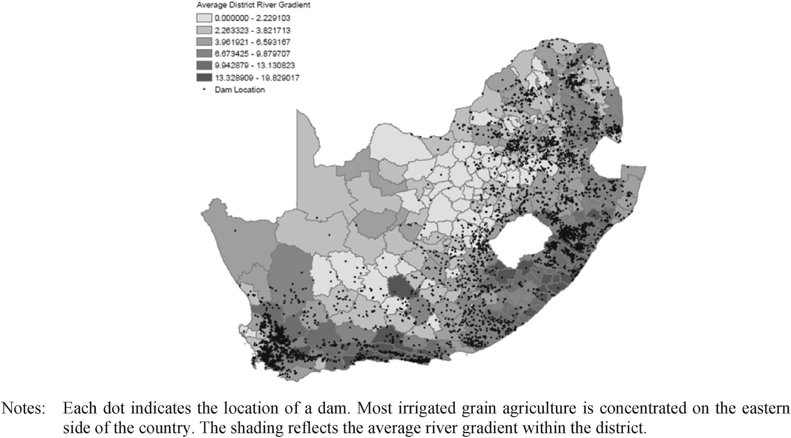
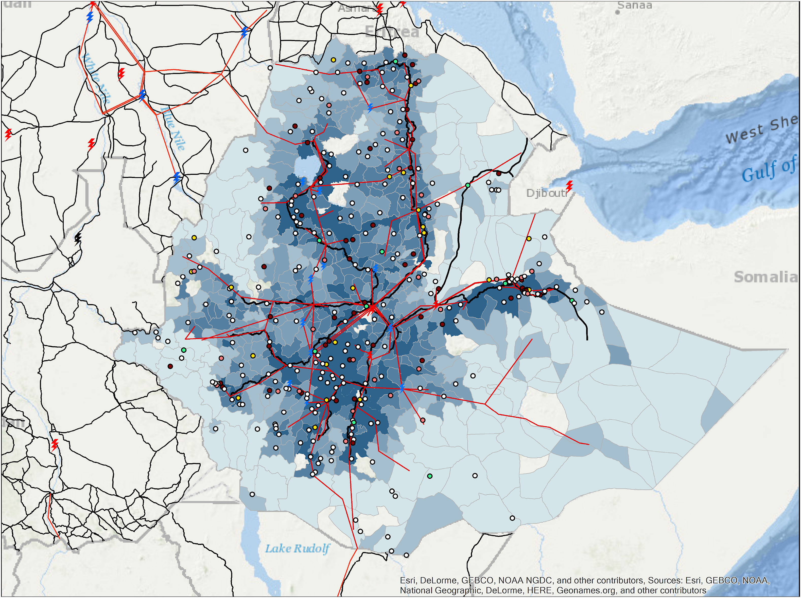
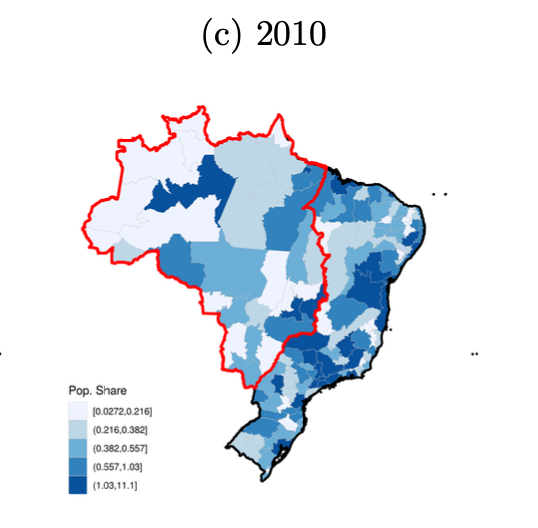

```{r setup, include=FALSE}
# Disable warning messages
knitr::opts_chunk$set(warning = FALSE, message = FALSE)
```

# Methodology & general code

In the following notebook we replicate the charts for all 5 papers. Contentwise, the code follows always the same structure. We first load the data, then we create the chart and finally we save the chart as a .png file.

First we load the needed packages:

```{r}
library(osmdata)
library(sf)
library(spData)
library(tidyverse)
library(geodata)
library(readxl)
library(ggplot2)
library(raster)
library(terra)
```

## [Paper 1](https://www.sciencedirect.com/science/article/pii/S0304387818300166#appsec1)

### Data loading

The authors of the paper provide a link to the data, however, the link is unfortunately outdated. Yet, the data is available in a newer version on the website (authors used 2013 data, we use 2024 data).

Moreover, the river gradient data was not directly available, so we use the elevation data from the geodata package to retrieve and later calculate gradients.

```{r}
# Set geodata default path
geodata_path("data/paper1")

# Dams, Source:https://www.dws.gov.za/DSO/publications.aspx
# Data was only available as .KMZ and not readable by st_read so needed to be converted by:
# https://mygeodata.cloud/converter/kml-to-geojson
dams <- st_read(
  "data/paper1/Registered Dams Oct20241.geojson"
)

# Dam metadata (same source but an Excel file)
dam_met <- read_excel(
  "data/paper1/List of Registered Dams Oct2024.xlsx",
  col_types = rep("text", ncol(read_excel("data/paper1/List of Registered Dams Oct2024.xlsx")))
) %>%
  mutate(`Completion date` = na_if(as.numeric(`Completion date`), 0))

# RSA boundaries - downloaded from GDAM and temporarily stored
sa_districts_sf <- st_as_sf(gadm(country = "ZAF", level = 3))

# River data - Download elevation data for South Africa
elevation <- elevation_30s(country = "ZAF")
```

### Data wrangling

We try to apply the same data cleaning as the authors though we deal with more recent data, i.e.:

> "The data was accessed on August 23, 2013, including all dams listed as of March 2013. About 15 percent of dams were dropped because of missing critical information that could not be verified (690/4,830). For most missing dams (658/690), the missing information was completion date. Online internet searches for this information suggest that most were very old (prior to the analysis period) or no longer operational. Of those dropped, 499 reported a purpose of “irrigation.” The resulting dataset included 4,140  dams, which were restricted to the subset of irrigation dams (3,176)."

Furthermore, we calculate the mean gradient for each district and add it to the districts data.

```{r}
# Now filter dams, as done in the paper, i.e, omit missing completion date and filter for irrigation
dams <- dams %>%
  left_join(dam_met,
    by = join_by("COL52A1FC9ABE076254" == "No of dam"),
    # relationship = "many-to-many"
  ) %>%
  filter(!is.na(`Completion date`), str_detect(tolower(Purpose), "irrigation")) %>%
  distinct(across(-`geometry`), .keep_all = TRUE) # Delete the 2 duplicate cases identified

# Convert districts to terra format for raster operations
districts_vect <- vect(sa_districts_sf)

# Calculate slope from elevation
slope <- terrain(elevation, v = "slope", unit = "degrees")

# Calculate zonal statistics (mean slope) for each district
district_gradients <- terra::extract(slope, districts_vect, fun = mean, na.rm = TRUE)

# Add gradient data to districts
sa_districts_sf$gradient <- district_gradients$slope

# Ensure same CRS
dams <- st_transform(dams, st_crs(sa_districts_sf))

# Clip dams to South Africa boundaries
sa_boundary <- st_union(sa_districts_sf)
dams_clipped <- st_intersection(dams, sa_boundary)
```

### Plotting

Finally, we output the plot:

```{r}
# Create plot
ggplot() +
  # Add districts with gradient fill
  geom_sf(
    data = sa_districts_sf,
    aes(fill = gradient),
    color = "white",
    size = 0.1
  ) +
  # Add clipped dams
  geom_sf(
    data = dams_clipped,
    size = 0.2,
    color = "black",
    aes(shape = "Dam Location")
  ) + # Add to legend
  # Style the gradient fill
  scale_fill_gradientn(
    colors = grey.colors(6, start = 0.9, end = 0.2),
    name = "Average District\nRiver Gradient",
    breaks = c(
      0, 2.229103, 3.821713, 6.593167,
      9.879707, 13.130823, 19.829017
    ),
    labels = function(x) format(x, digits = 6),
    guide = guide_colorbar(
      order = 1,
      nbin = 100, # For smoother color transition
      ticks.colour = "black",
      frame.colour = "black",
      frame.linewidth = 0.5
    )
  ) +
  # Add shape scale for dam points in legend
  scale_shape_manual(
    values = c("Dam Location" = 16),
    name = NULL,
    guide = guide_legend(order = 2)
  ) +
  # Customize theme
  theme_minimal() +
  theme(
    panel.grid = element_blank(),
    axis.text = element_blank(),
    axis.title = element_blank(),
    plot.title = element_text(hjust = 0.5, size = 14),
    legend.position = "left",
    legend.box = "vertical",
    legend.margin = margin(0, 0, 0, 0),
    legend.spacing = unit(0.1, "cm"),
    legend.title = element_text(size = 10),
    legend.text = element_text(size = 8),
    legend.key.size = unit(0.5, "cm")
  ) +
  # Add titles
  labs(
    title = "South African Dams and River Gradients",
    caption = "Source: Based on Mettetal (2019) but with 2024 instead of 2013 data"
  )
```

In comparison the first paper map looked as follows:



## [Paper 2](https://www.sciencedirect.com/science/article/pii/S0166046220303100)

### Data loading

Unfortunately, again the data was not directly available. Therefore, we leverage some r packages to get the data for highways, powergrids (osmdata) and population data from 2020 (geodata). The ESSR survey data was directly available via the World Bank data repositories as a CSV (2011/12) data used as in the paper. We load all of these in the following:

```{r}
# Set geodata default path
geodata_path("data/paper2")

# Get Ethiopia districts
eth_districts_sf <- gadm(country = "ETH", level = 3)
eth_districts_sf <- st_as_sf(eth_districts_sf)

# Get population data and process it for Ethiopia
ethiopia_pop <- population(2020, res = 5)
ethiopia_pop <- crop(ethiopia_pop, ext(eth_districts_sf))
ethiopia_pop <- mask(ethiopia_pop, vect(eth_districts_sf))

# Convert districts to same CRS as population data if needed
eth_districts_sf <- st_transform(eth_districts_sf, crs(ethiopia_pop))

# WB data: https://microdata.worldbank.org/index.php/catalog/2053/data-dictionary
# Read in the survey data and get it in the right shape
wb_data <- read_csv("data/paper2/pub_eth_householdgeovariables_y1.csv") %>%
  group_by(ea_id) %>%
  summarise(
    LAT_DD_MOD = mean(LAT_DD_MOD, na.rm = TRUE),
    LON_DD_MOD = mean(LON_DD_MOD, na.rm = TRUE)
  )

# Transform it to GEO data and clip to Ethiopia
wb_data_geo <- st_as_sf(wb_data, coords = c("LON_DD_MOD", "LAT_DD_MOD"), crs = 4326)
wb_data_geo <- st_transform(wb_data_geo, crs(ethiopia_pop))

# Get high voltage power lines with comprehensive voltage range
ethiopia_hv_power <- opq("Ethiopia") %>%
  add_osm_feature(key = "power", value = c("line", "cable")) %>%
  add_osm_feature(key = "voltage", value = paste0(seq(66, 500, by = 1), "000")) %>%
  osmdata_sf()

# Clean and clip power lines
hv_lines_clean <- ethiopia_hv_power$osm_lines %>%
  mutate(voltage = str_extract(voltage, "\\d+")) %>%
  mutate(voltage_kv = as.numeric(voltage) / 1000) %>%
  filter(!is.na(voltage_kv)) %>%
  st_intersection(eth_districts_sf)

# Get major roads and clip to Ethiopia
ethiopia_roads <- opq("Ethiopia") %>%
  add_osm_feature(
    key = "highway",
    value = c("motorway", "trunk")
  ) %>%
  osmdata_sf()
```

### Data wrangling

We calculate the population density for each district and clip the roads to the Ethiopia boundary.

```{r}
# Clip roads to Ethiopia boundary
roads_clipped <- ethiopia_roads$osm_lines %>%
  st_intersection(eth_districts_sf)

# Calculate population density by district
districts_pop <- terra::extract(ethiopia_pop, vect(eth_districts_sf), fun = sum, na.rm = TRUE)

# Add population to districts dataset
eth_districts_sf$total_pop <- districts_pop[, 2] # The second column contains the values

# Calculate area in square kilometers
eth_districts_sf$area_km2 <- as.numeric(st_area(eth_districts_sf)) / 1000000

# Calculate density (people per km2)
eth_districts_sf$pop_density <- eth_districts_sf$total_pop / eth_districts_sf$area_km2
```

### Plotting

Finally, we output the plot:

```{r}
# Create the final plot
ggplot() +
  geom_sf(
    data = eth_districts_sf,
    aes(fill = pop_density),
    color = "gray50",
    linewidth = 0.1
  ) +
  scale_fill_gradientn(
    colors = c("white", "lightblue", "royalblue", "navy"),
    trans = "log",
    name = "Population\nDensity\n(people/km²)",
    labels = scales::comma,
    guide = guide_colorbar(order = 1)
  ) +
  geom_sf(
    data = roads_clipped,
    aes(color = "Highway"),
    linewidth = 0.5
  ) +
  geom_sf(
    data = hv_lines_clean,
    aes(color = "HV grid"),
    linewidth = 0.35
  ) +
  geom_sf(
    data = wb_data_geo,
    aes(shape = "Survey village"),
    color = "black",
    size = 1,
    alpha = 0.6
  ) +
  scale_color_manual(
    name = NULL,
    values = c("Highway" = "black", "HV grid" = "red"),
    guide = guide_legend(order = 2)
  ) +
  scale_shape_manual(
    name = NULL,
    values = c("Survey village" = 16),
    guide = guide_legend(order = 3)
  ) +
  guides(
    fill = guide_colorbar(order = 1),
    color = guide_legend(
      order = 2,
      override.aes = list(
        linewidth = 1,
        shape = NA, # Removes the box
        linetype = 1
      )
    ),
    shape = guide_legend(order = 3)
  ) +
  theme_minimal() +
  labs(
    title = "High Voltage Power Grid Network and Major Roads in Ethiopia",
    subtitle = "Showing transmission lines ≥66kV, population density by district, and villages",
    caption = "Data sources: OpenStreetMap, WorldPop 2020, World Bank (2012)\n
      Based on Fried and Lagakos (2021)"
  ) +
  theme(
    legend.position = "left",
    plot.title = element_text(size = 10),
    plot.subtitle = element_text(size = 8),
    plot.caption = element_text(size = 6),
    axis.text = element_blank(),
    axis.title = element_blank()
  )
```

In comparison the second paper map looked as follows: 

The different color labeling of the surveyed villages is unfortunately not explained in the paper. Therefore, we leave the points black.

## Paper 3

### Data loading

The authors of the paper do not provide a direct link to the data, but they refer to the Brazilian Statistical Bureau (IBGE) when introducing the "meso-regions," which are the political boundaries used in their plots.

We retrieved population data from the aforementioned IBGE website and used geographical data available in the R package geobr. While the authors reproduced the same plot for three different years — 1950, 1980, and 2010 — due to a lack of data, we were only able to reproduce the plot for the most recent year. Specifically, on the IBGE website, we found data for 2009. However, we assume no significant variations in population occurred within a single year, allowing us to proceed with our analysis.

```{r}
# Read the .xls file with the Brasilian population for 2009  
df <- read_excel("hw1/data/paper3/UF_Municipio.xls", skip = 4, col_names = TRUE)

# Get the geographical data from the package geobr
state <- read_state(year=2010)
meso <- read_meso_region(year=2010)
```

### Data wrangling

From the package geobr, data at the meso-regions level are available, but they have a different level of granularity compared to the population data. This discrepancy can be easily verified by comparing the number of observations in the two datasets. Due to this inconsistency between the geographical data and the population data, we could not exactly replicate the authors' plots, which show the Brazilian population shares for meso-regions. Instead, we had to perform the analysis at the state level.

First, we grouped the population data by state to ensure that both datasets referred to the same political boundaries. Next, we joined the two datasets based on the state code. After this, we created a column indicating the population share, multiplying the ratio by 100 to make the results more consistent with the paper. Finally, we filtered the data for the North and Central-West regions to highlight the borders in the plot. 

```{r}
# Convert ESTIMADA (=population) into a numerical variable and # handle missing values by setting them to 0
df <- df %>%
  mutate(ESTIMADA = as.numeric(ESTIMADA)) %>%
  mutate(ESTIMADA = replace_na(ESTIMADA, 0))

# Group by the state code 
df_grouped <- df %>% 
  group_by(COD...2) %>%
  summarise(
    Total_Estimada = sum(ESTIMADA, na.rm = TRUE),  
    Count = n()  
  )

# Remove the last row of df_merged - in df the last row was the # total and it would have been considered another meso region
df_grouped <- df_grouped %>% 
  slice(-n())

# Merge the geographical data with the population data 
df_merged <- state %>%
  left_join(df_grouped, by = c("code_state" = "COD...2"))

# Create the column pop_share
df_merged <- df_merged %>%
  mutate(pop_share = Total_Estimada / sum(Total_Estimada)*100) 

# Filter for North and Central-West regions
regions_to_highlight <- df_merged %>%
  filter(name_region %in% c("Centro Oeste", "Norte"))

# Join the geometries of these regions in a polygon 
regions_union <- regions_to_highlight %>%
  st_union() %>% 
  st_as_sf()
```


### Plotting

```{r}
ggplot(data = df_merged) +
  geom_sf(aes(fill = pop_share), color = "white") +
  scale_fill_gradientn(
    colors = c("lightblue", "blue", "darkblue"),
    name = "Pop. Share",
    limits = c(0, 25)) +
  geom_sf(data = regions_union, fill = NA, color = "red", linewidth = 1)
```

In comparison the third paper map looked as follows: 

## Paper 4

### Data loading

### Data wrangling

### Plotting

In comparison the fourth paper map looked as follows: 

## Paper 5

### Data loading

### Data wrangling

### Plotting

In comparison the fifth paper map looked as follows: 
