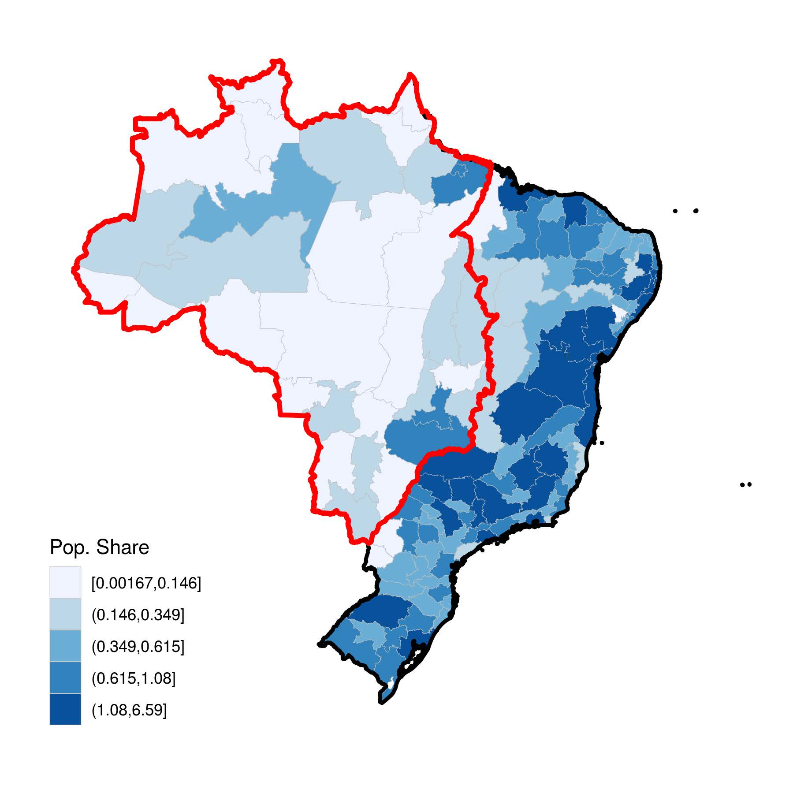
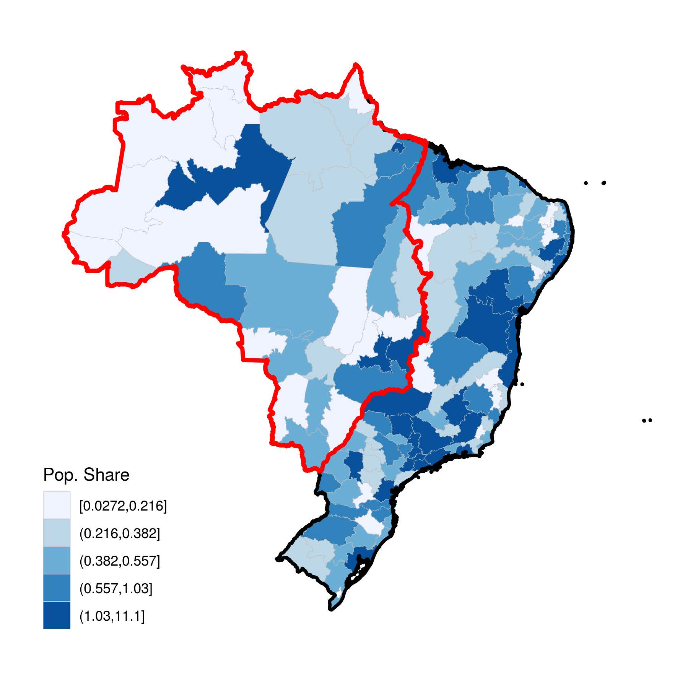
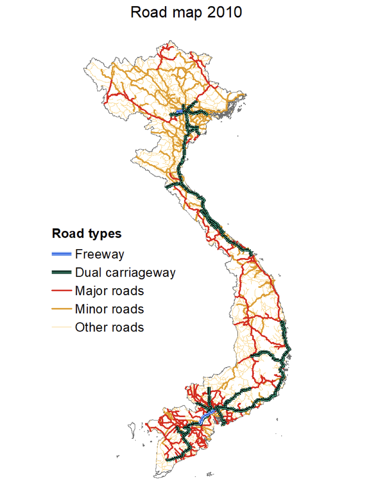
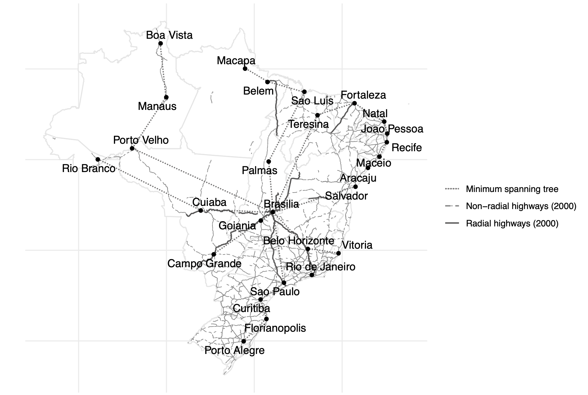

<hr>

```{css, echo=FALSE}
h1.title {
  text-align: center;
}

h4.author, h4.date {
  text-align: center;
}

.author {
  text-align: center;
}

.date {
  text-align: center;
}
```

```{r setup, include=FALSE}
# Disable warning messages
knitr::opts_chunk$set(warning = FALSE, message = FALSE)
```

<div style="text-align: center;">
  
</div>

<hr>

# Methodology & general code

In the following notebook we replicate the charts for all 5 papers. Contentwise, the code follows always the same structure. We first load the data, secondly manipulate it, then we create the chart and finally display it.

First we load the needed packages:

```{r}
# Main tidyverse (includes ggplot2)
library(tidyverse)

# Spatial packages
library(sf)
library(terra) # Newer replacement for raster
library(osmdata) # OpenStreetMap data
library(spData) # Spatial data
library(geobr) # Brazilian boundaries
library(censobr) # Brazilian population data
library(lwgeom) # Needed for st_make_valid
library(rmapshaper) # Simplify and edit spatial features
library(ggrepel) # Repel overlapping text labels in ggplot

# Data import
library(geodata) # For elevation data
library(readxl) # Import and read Excel files
```

<hr>

# [Paper 1](https://www.sciencedirect.com/science/article/pii/S0304387818300166#appsec1)

## Data loading

The authors of the paper provide a link to the data, however, the link is unfortunately outdated. Yet, the data is available in a newer version on [this website](https://www.dws.gov.za/DSO/publications.aspx). The authors used 2013 data, we use 2024 data but had to convert the downloaded data to geojson format before usage.

Moreover, the river gradient data was not directly available, so we use the elevation data from the geodata package to retrieve and later calculate river gradients.

```{r}
# Set geodata default path
geodata_path("data/paper1")

# Dams, Source:https://www.dws.gov.za/DSO/publications.aspx
# Data was only available as .KMZ and not readable by st_read so needed to be converted by:
# https://mygeodata.cloud/converter/kml-to-geojson
dams <- st_read(
  "data/paper1/Registered Dams Oct20241.geojson"
)

# Dam metadata (same source but an Excel file)
dam_met <- read_excel(
  "data/paper1/List of Registered Dams Oct2024.xlsx",
  col_types = rep("text", ncol(read_excel("data/paper1/List of Registered Dams Oct2024.xlsx")))
) %>%
  mutate(`Completion date` = na_if(as.numeric(`Completion date`), 0))

# RSA boundaries - downloaded from GDAM
sa_districts_sf <- st_as_sf(gadm(country = "ZAF", level = 3))

# River data - Download elevation data for South Africa
elevation <- elevation_30s(country = "ZAF")
```

## Data wrangling

We try to apply the same data cleaning as the authors though we deal with more recent data, i.e.:

> "The data was accessed on August 23, 2013, including all dams listed as of March 2013. About 15 percent of dams were dropped because of missing critical information that could not be verified (690/4,830). For most missing dams (658/690), the missing information was completion date. Online internet searches for this information suggest that most were very old (prior to the analysis period) or no longer operational. Of those dropped, 499 reported a purpose of “irrigation.” The resulting dataset included 4,140  dams, which were restricted to the subset of irrigation dams (3,176)."

Furthermore, we calculate the mean gradient for each district and add it to the districts data.

```{r}
# Now filter dams, as done in the paper, i.e, omit missing completion date and filter for irrigation
dams <- dams %>%
  left_join(dam_met,
    by = join_by("COL52A1FC9ABE076254" == "No of dam"),
    # relationship = "many-to-many"
  ) %>%
  filter(!is.na(`Completion date`), str_detect(tolower(Purpose), "irrigation")) %>%
  distinct(across(-`geometry`), .keep_all = TRUE) # Delete the 2 duplicate cases identified

# Convert districts to terra format for raster operations
districts_vect <- vect(sa_districts_sf)

# Calculate slope from elevation
slope <- terrain(elevation, v = "slope", unit = "degrees")

# Calculate zonal statistics (mean slope) for each district
district_gradients <- terra::extract(slope, districts_vect, fun = mean, na.rm = TRUE)

# Add gradient data to districts
sa_districts_sf$gradient <- district_gradients$slope

# Ensure same CRS
dams <- st_transform(dams, st_crs(sa_districts_sf))

# Clip dams to South Africa boundaries
sa_boundary <- st_union(sa_districts_sf)
dams_clipped <- st_intersection(dams, sa_boundary)
```

## Plotting

Finally, we output the plot:

```{r}
# Create plot
ggplot() +
  # Add districts with gradient fill
  geom_sf(
    data = sa_districts_sf,
    aes(fill = gradient),
    color = "white",
    size = 0.1
  ) +
  # Add clipped dams
  geom_sf(
    data = dams_clipped,
    size = 0.2,
    color = "black",
    aes(shape = "Dam Location")
  ) + # Add to legend
  # Style the gradient fill
  scale_fill_gradientn(
    colors = grey.colors(6, start = 0.9, end = 0.2),
    name = "Average District\nRiver Gradient",
    breaks = c(
      0, 2.229103, 3.821713, 6.593167,
      9.879707, 13.130823, 19.829017
    ),
    labels = function(x) format(x, digits = 6),
    guide = guide_colorbar(
      order = 1,
      nbin = 100, # For smoother color transition
      ticks.colour = "black",
      frame.colour = "black",
      frame.linewidth = 0.5
    )
  ) +
  # Add shape scale for dam points in legend
  scale_shape_manual(
    values = c("Dam Location" = 16),
    name = NULL,
    guide = guide_legend(order = 2)
  ) +
  # Customize theme
  theme_minimal() +
  theme(
    panel.grid = element_blank(),
    axis.text = element_blank(),
    axis.title = element_blank(),
    plot.title = element_text(hjust = 0.5, size = 14),
    legend.position = "left",
    legend.box = "vertical",
    legend.margin = margin(0, 0, 0, 0),
    legend.spacing = unit(0.1, "cm"),
    legend.title = element_text(size = 10),
    legend.text = element_text(size = 8),
    legend.key.size = unit(0.5, "cm")
  ) +
  # Add titles
  labs(
    title = "South African Dams and River Gradients",
    caption = "Source: Based on Mettetal (2019) but with 2024 instead of 2013 data"
  )
```

In comparison the first paper map looked as follows:


<hr>

# [Paper 2](https://www.sciencedirect.com/science/article/pii/S0166046220303100)

## Data loading

Unfortunately, again the data was not directly available. Therefore, we leverage some R packages, i.e., to get the data for highways, powergrids we used the osmdata package and for population data from 2020 we used the geodata package. The [ERSS survey](https://microdata.worldbank.org/index.php/catalog/2053/data-dictionary) data was directly available via the World Bank data repositories as a CSV (2011/12) and is identical to the data used in the paper. We load all of these in the following:

```{r}
# Set geodata default path
geodata_path("data/paper2")

# Get Ethiopia districts
eth_districts_sf <- gadm(country = "ETH", level = 3)
eth_districts_sf <- st_as_sf(eth_districts_sf)

# Get population data and process it for Ethiopia
ethiopia_pop <- population(2020, res = 5)
ethiopia_pop <- crop(ethiopia_pop, ext(eth_districts_sf))
ethiopia_pop <- mask(ethiopia_pop, vect(eth_districts_sf))

# Convert districts to same CRS as population data if needed
eth_districts_sf <- st_transform(eth_districts_sf, crs(ethiopia_pop))

# WB data: https://microdata.worldbank.org/index.php/catalog/2053/data-dictionary
# Read in the survey data and get it in the right shape
wb_data <- read_csv("data/paper2/pub_eth_householdgeovariables_y1.csv") %>%
  group_by(ea_id) %>%
  summarise(
    LAT_DD_MOD = mean(LAT_DD_MOD, na.rm = TRUE),
    LON_DD_MOD = mean(LON_DD_MOD, na.rm = TRUE)
  )

# Transform it to GEO data and clip to Ethiopia
wb_data_geo <- st_as_sf(wb_data, coords = c("LON_DD_MOD", "LAT_DD_MOD"), crs = 4326)
wb_data_geo <- st_transform(wb_data_geo, crs(ethiopia_pop))

# Get high voltage power lines with comprehensive voltage range
ethiopia_hv_power <- opq("Ethiopia") %>%
  add_osm_feature(key = "power", value = c("line", "cable")) %>%
  add_osm_feature(key = "voltage", value = paste0(seq(66, 500, by = 1), "000")) %>%
  osmdata_sf()

# Clean and clip power lines
hv_lines_clean <- ethiopia_hv_power$osm_lines %>%
  mutate(voltage = str_extract(voltage, "\\d+")) %>%
  mutate(voltage_kv = as.numeric(voltage) / 1000) %>%
  filter(!is.na(voltage_kv)) %>%
  st_intersection(eth_districts_sf)

# Get major roads and clip to Ethiopia
ethiopia_roads <- opq("Ethiopia") %>%
  add_osm_feature(
    key = "highway",
    value = c("motorway", "trunk")
  ) %>%
  osmdata_sf()
```

## Data wrangling

We calculate the population density for each district and clip the roads to the Ethiopia boundary. Furthermore, it looks like the authors used slightly different road and powergrid networks. However, overall the grids look broadly similar when utilizing OpenStreetMap data via the osmdata package. 

```{r}
# Clip roads to Ethiopia boundary
roads_clipped <- ethiopia_roads$osm_lines %>%
  st_intersection(eth_districts_sf)

# Calculate population density by district
districts_pop <- terra::extract(ethiopia_pop, vect(eth_districts_sf), fun = sum, na.rm = TRUE)

# Add population to districts dataset
eth_districts_sf$total_pop <- districts_pop[, 2] # The second column contains the values

# Calculate area in square kilometers
eth_districts_sf$area_km2 <- as.numeric(st_area(eth_districts_sf)) / 1000000

# Calculate density (people per km2)
eth_districts_sf$pop_density <- eth_districts_sf$total_pop / eth_districts_sf$area_km2
```

## Plotting

Finally, we output the plot:

```{r}
# Create the final plot
ggplot() +
  # Administrative boundaries
  geom_sf(
    data = eth_districts_sf,
    aes(fill = pop_density),
    color = "gray50",
    linewidth = 0.1
  ) +
  # Population density
  scale_fill_gradientn(
    colors = c("white", "lightblue", "royalblue", "navy"),
    trans = "log",
    name = "Population\nDensity\n(people/km²)",
    labels = scales::comma,
    guide = guide_colorbar(order = 1)
  ) +
  # Adding roads
  geom_sf(
    data = roads_clipped,
    aes(color = "Highway"),
    linewidth = 0.5
  ) +
  # Adding HV powerlines
  geom_sf(
    data = hv_lines_clean,
    aes(color = "HV grid"),
    linewidth = 0.35
  ) +
  # Adding survey villages
  geom_sf(
    data = wb_data_geo,
    aes(shape = "Survey village"),
    color = "black",
    size = 1,
    alpha = 0.6
  ) +
  # Adding legends
  scale_color_manual(
    name = NULL,
    values = c("Highway" = "black", "HV grid" = "red"),
    guide = guide_legend(order = 2)
  ) +
  scale_shape_manual(
    name = NULL,
    values = c("Survey village" = 16),
    guide = guide_legend(order = 3)
  ) +
  # Styling
  guides(
    fill = guide_colorbar(order = 1),
    color = guide_legend(
      order = 2,
      override.aes = list(
        linewidth = 1,
        shape = NA, # Removes the box
        linetype = 1
      )
    ),
    shape = guide_legend(order = 3)
  ) +
  theme_minimal() +
  labs(
    title = "High Voltage Power Grid Network and Major Roads in Ethiopia",
    subtitle = "Showing transmission lines ≥66kV, population density by district, and villages",
    caption = "Data sources: OpenStreetMap, WorldPop 2020, World Bank (2012)\n
      Based on Fried and Lagakos (2021)"
  ) +
  theme(
    legend.position = "left",
    plot.title = element_text(size = 10),
    plot.subtitle = element_text(size = 8),
    plot.caption = element_text(size = 6),
    axis.text = element_blank(),
    axis.title = element_blank()
  )
```

In comparison the second paper map looked as follows: 


The different color labeling of the surveyed villages is unfortunately not explained in the paper. Therefore, we leave the points black.

<hr>

# [Paper 3](https://papers.ssrn.com/sol3/papers.cfm?abstract_id=3776990)

## Data loading

The authors of the paper do not provide a direct link to the data, but they refer to the Brazilian Statistical Bureau (IBGE) when talkig about population data and introducing the "meso-regions", which are the political boundaries used in their plots.

We retrieve population data via the censobr package, which compiled census and population data based on IBGE statistics. Administrative boundary data for is available in the R package geobr. 

While the authors produced the same plot for three different years — 1950, 1980, and 2010 — due to a lack of data, we were only able to reproduce the plot for the most recent year, i.e., 2010 and with flaws for 1960 (i.e., we're missing around 13 mln people of the overall population in 1960 due to data compilation issues of the earlier census approaches of the IBGE such as non-digitalized records - [see here](https://ipeagit.github.io/censobr/reference/read_population.html#-census) for more information).

On the IBGE website, we found data for 2009, while the censobr package provides the 2010 data. It also provides census data for 1980 and 1960. However, for 1980, it seems that the population weights are missing. Therefore, we decided to focus on the 2010 and 1960 data.


```{r}
# Read in the Brasilian population for 2010 using the censobr package
# This also contains 1980, and 1960 data, but 1980 without weights, and 1960 only partially
pop_2010 <- read_population(
  year = 2010,
  columns = c("code_state", "code_region", "code_muni", "V0010"),
  showProgress = FALSE,
  as_data_frame = TRUE,
  # cache = FALSE
) %>% # Group by municipality code
  group_by(code_muni) %>%
  summarise(
    total_population_2010 = sum(V0010, rm.na = TRUE)
  )

# Get 1960 data (which is missing approx 13 mln people though -
# it's only a rough estimate and combined from 2 datasets, see censobr description)
pop_1960 <- read_population(
  year = 1960,
  columns = c("code_muni_1960", "censobr_weight"),
  showProgress = FALSE,
  as_data_frame = TRUE,
  # cache = FALSE
) %>% # Group by municipality code
  group_by(code_muni_1960) %>%
  summarise(
    total_population_1960 = sum(censobr_weight, rm.na = TRUE)
  )

# Get the geographical data from the package geobr and validate if necessary
meso <- read_meso_region(year = 2010) %>%
  st_make_valid()
region <- read_region(year = 2010)
muni <- read_municipality(year = 2010) %>%
  st_make_valid()
```

## Data wrangling

First, we join the 1960 and 2010 population data with munipalicity level data to ensure that both datasets refer to the same political boundaries. Next, we joined the two datasets based with the meso code and group on meso level to get the wanted granularity. We had to take a rather coarse-granular approach by using the `st_centroid()` function to match meso-regions with municipalities. This leads us to loosing out roughly on 50'000 inhabitants in 2010. 

After this, we created a column indicating the population share, multiplying the ratio by 100 to make the results more consistent with the paper. Finally, we added the boundary data for the North and Central-West regions to highlight the borders in the plot as done by the authors. Needing `sf_remove_holes()` to avoid inner borders, we loose a bit of granularity in the outer borders of the broader regions.

```{r}
# First, join the population data with municipal boundaries
pop_spatial <- muni %>%
  left_join(pop_2010, by = "code_muni") %>%
  left_join(pop_1960, by = join_by("code_muni" == "code_muni_1960"))

# Use st_centroid to ensure each municipality is counted only once
pop_meso <- pop_spatial %>%
  st_centroid() %>% # Convert polygons to points
  st_join(meso) %>% # Join with meso regions
  group_by(code_meso) %>%
  summarise(
    total_population_2010 = sum(total_population_2010, na.rm = TRUE),
    total_population_1960 = sum(total_population_1960, na.rm = TRUE)
  ) %>%
  st_drop_geometry() # Remove geometry before joining back

# Now join back with meso geometries
pop_meso <- meso %>%
  left_join(pop_meso, by = "code_meso")

# Create pop_share
df_merged <- pop_meso %>%
  mutate(
    pop_share_2010 = total_population_2010 / sum(total_population_2010) * 100,
    pop_share_1960 = total_population_1960 / sum(total_population_1960) * 100,
  )

# Aggregate regions as the author's did to get the correct boundaries
region <- region %>%
  mutate(
    name_region = case_when(
      name_region %in% c("Centro Oeste", "Norte") ~ 2,
      TRUE ~ 1
    )
  ) %>%
  dplyr::select(name_region, geom) %>%
  group_by(name_region) %>%
  summarise(geom = st_union(geom)) %>%
  sfheaders::sf_remove_holes()
```


## Plotting

We reproduce the same chart for 2010, as the authors did. Due to data non-availability, we rely on a further chart for 1960, instead of 1950. The 1960 chart resembles the 1950 chart of the authors surprisingly well, despite the aforementioned data issues. The Northern regions being significantly different might be explained by the censobr authors who inter alia state that for 1960:
>"Information is missing for the states of the former Northern Region, Maranhão, Piaui, Guanabara, Santa Catarina, and Espírito Santo".

Lastly, we omit 1980 data, since the population weights were missing in the censobr dataset and we were not able to infer them accurately.

```{r, figures-side, fig.show="hold", out.width="50%"}
# Final plot - 1960
ggplot(data = df_merged) +
  ggtitle("(c) 1960") +
  theme_minimal() +
  theme(
    plot.title = element_text(hjust = 0.5), # Center title while keeping minimal theme
    panel.grid = element_line(color = "gray90"), # Make grid lines lighter
    axis.text = element_blank(),
    axis.ticks = element_blank()
  ) +
  # Add population share fill
  geom_sf(aes(fill = pop_share_1960), color = "white", size = 0.1) +
  # Color scales
  scale_fill_stepsn(
    name = "Pop. Share",
    breaks = c(0, 0.216, 0.382, 0.557, 1.02, 11.12),
    labels = scales::number_format(accuracy = 0.001),
    colors = c("#eff3ff", "#bdd7e7", "#6baed6", "#3182bd", "#08519c"), # Made lower values darker
    values = scales::rescale(c(0, 0.216, 0.382, 0.557, 1.02, 11.12))
  ) +
  # Add region boundaries
  geom_sf(data = region, aes(color = factor(name_region)), fill = NA, linewidth = 1) +
  scale_color_manual(values = c("black", "red")) +
  guides(color = "none") +
  # Add titles
  labs(
    caption = "Source: Based on Pellegrina and Sotelo (2021)"
  )

# Final plot - 2010
ggplot(data = df_merged) +
  ggtitle("(c) 2010") +
  theme_minimal() +
  theme(
    plot.title = element_text(hjust = 0.5), # Center title while keeping minimal theme
    panel.grid = element_line(color = "gray90"), # Make grid lines lighter
    axis.text = element_blank(),
    axis.ticks = element_blank()
  ) +
  # Add population share fill
  geom_sf(aes(fill = pop_share_2010), color = "white", size = 0.1) +
  # Color scales
  scale_fill_stepsn(
    name = "Pop. Share",
    breaks = c(0, 0.216, 0.382, 0.557, 1.02, 11.12),
    labels = scales::number_format(accuracy = 0.001),
    colors = c("#eff3ff", "#bdd7e7", "#6baed6", "#3182bd", "#08519c"), # Made lower values darker
    values = scales::rescale(c(0, 0.216, 0.382, 0.557, 1.02, 11.12))
  ) +
  # Add region boundaries
  geom_sf(data = region, aes(color = factor(name_region)), fill = NA, linewidth = 1) +
  scale_color_manual(values = c("black", "red")) +
  guides(color = "none") +
  # Add titles
  labs(
    caption = "Source: Based on Pellegrina and Sotelo (2021)"
  )
```

In comparison the third paper map looked as follows (left 1950, right 2010):

<table>
<tr>
<td></td>
<td></td>
</tr>
</table>

<hr>

# [Paper 4](https://economics.mit.edu/sites/default/files/publications/Catastrophe_Risk_and_Settlement_Location.pdf)

We are looking for a shapefile or dataset specifically containing road network data for Vietnam. We inspected data from [GADM](https://gadm.org/data.html#google_vignette) but none of the layers in the file appear to contain road network data. All layers are polygons representing administrative boundaries.

## Data loading

```{r}
# Define the base path
path <- "data/paper4"

# We inspect data from Humdata:
st_layers(file.path(path, "ROADS/vnm_rdsl_2015_OSM.shp"))
# Read the shapefile into an sf object
vietnam_roads <- st_read(file.path(path, "ROADS/vnm_rdsl_2015_OSM.shp"))

# Get all the unique values from the column 'type'
unique_values <- unique(vietnam_roads$type)
print(unique_values)
```

Although the data is from 2015, whereas the paper displays roads from 2010, we decide to use this data as road networks.

```{r}
# We inspect data from SimpleMaps:
st_layers(file.path(path, "VIETNAM/"))

vietnam_map <- st_read(file.path(path, "VIETNAM", layer = "vn.shp"))
```

We decide to move forward with this data as Vietnam boundary.

## Data wrangling

We use the [author's documentation](https://www.openicpsr.org/openicpsr/project/207641/version/V1/view;jsessionid=3EBB67FC7920B2090C0D74C349E99F93?path=/openicpsr/207641/fcr:versions/V1/Public-replication-files/Replication_README.pdf&type=file) to understand how he categorised the types of roads.

```{r}
# Categorise roads into group by trying to replicate the author's logic
vietnam_roads <- vietnam_roads %>%
  mutate(
    road_category = case_when(
      type %in% c("motorway", "motorway_link") ~ "Freeway",
      type %in% c("trunk", "trunk_link") ~ "Dual Carriageway",
      type %in% c("secondary") ~ "Major Roads",
      type %in% c("primary", "primary_link", "secondary_link", "tertiary", "tertiary_link", "residential", "living_street") ~ "Minor Roads",
      TRUE ~ "Other Roads"
    )
  )
```

## Plotting

```{r}
ggplot() +
  # Adding the map of Vietnam as the base layer, using a light grey fill like the paper
  geom_sf(data = vietnam_map, fill = "lightgrey", color = "black", linetype = "solid", size = 0.5) +

  # Overlaying the road network on the map.
  geom_sf(data = vietnam_roads, aes(color = road_category, linewidth = road_category), alpha = 0.8) +

  # The 'color' aesthetic differentiates road categories
  scale_color_manual(
    values = c(
      "Freeway" = "blue",
      "Dual Carriageway" = "darkgreen",
      "Major Roads" = "red",
      "Minor Roads" = "orange",
      "Other Roads" = "yellow"
    )
  ) +
  # The 'linewidth' aesthetic adjusts line thickness based on road types for visual distinction
  scale_linewidth_manual(
    values = c(
      "Freeway" = 1.1, # Thick line
      "Dual Carriageway" = 1.1, # Thick line
      "Major Roads" = 0.5, # Thin line
      "Minor Roads" = 0.5, # Thin line
      "Other Roads" = 0.3 # Extra thin line
    )
  ) +
  labs(
    title = "Road maps of Vietnam",
    color = "Road Category",
    linewidth = "Road Category" # Ensures the size legend matches the color legend
  ) +
  theme_minimal() +
  theme(
    panel.grid = element_blank(), # Removes grid lines
    axis.title = element_blank(), # Removes axis titles
    axis.text = element_blank(), # Removes axis text
    axis.ticks = element_blank() # Removes axis ticks
  )
```

In comparison the fourth paper map looked as follows: 



<hr>

# [Paper 5](https://web.stanford.edu/~memorten/ewExternalFiles/Morten_Oliveira_Brasilia.pdf)

The author's replication package is accessible, so we move forward with it's [code and data](https://www.openicpsr.org/openicpsr/project/183316/version/V1/view).

## Data loading

```{r}
path <- ("data/paper5/")

# Load the shapefile containing state boundaries for Brazil (1940 projection)
states <- st_read(file.path(path, "GIS_data/uf1940/uf1940_prj.shp"))
# Simplify the state boundaries to reduce file size while maintaining shape integrity
states_simple <- rmapshaper::ms_simplify(states, keep = 0.01, keep_shapes = TRUE)
```

## Data wrangling

Since the authors' description is very comprehensive, we proceed also with their data manipulation approach.

```{r}
# Define the year for the highways data
year <- 2000

# Construct the file path for the highways shapefile dynamically based on the year
file_name <- paste0("/", year, "/highways_", year, "_prj.shp")

# Load the highways shapefile for the specified year
all_highways <- st_read(file.path(path, "GIS_data/roads", file_name))
# Simplify the highways data
all_highways_simple <- rmapshaper::ms_simplify(all_highways, keep = 0.01, keep_shapes = TRUE)

# Load and simplify the minimum spanning tree (MST) shapefile for pie distribution
mst_pie <- st_read(file.path(path, "GIS_data/mst/mst_pie_prj.shp"))
mst_pie_simple <- rmapshaper::ms_simplify(mst_pie, keep = 0.01, keep_shapes = TRUE)

# Load and simplify MST data excluding pies for Rio region
mst_all_rio <- st_read(file.path(path, "GIS_data/mst/mst_all_rio_prj.shp"))
mst_all_rio_simple <- rmapshaper::ms_simplify(mst_all_rio, keep = 0.01, keep_shapes = TRUE)

# Load shapefile for capital cities and extract coordinates for labeling
capital_cities <- st_read(file.path(path, "GIS_data/cities/brazil_capital_cities_prj.shp"))
cities_xy <- cbind(capital_cities, st_coordinates(capital_cities))
```

## Plotting

Lastly, we also use their plotting approach:

```{r}
# Create a plot showing MST and highway networks in Brazil
ggplot() +
  # Add state boundaries as the base layer with light grey outlines
  geom_sf(data = states_simple, fill = "white", color = "grey90") +
  # Add the simplified MST data with a unique linetype and color
  geom_sf(data = mst_pie_simple, size = .6, linetype = "11", aes(color = "Minimum spanning tree"), show.legend = "line") +
  # Add non-radial highways with a dashed line style
  geom_sf(data = all_highways_simple %>% filter(dm_anlys_p == 1 & dm_radial == 0), size = .3, linetype = "dashed", aes(color = "Non-radial highways (2000)"), show.legend = "line") +
  # Add radial highways with a solid line style
  geom_sf(data = all_highways_simple %>% filter(dm_anlys_p == 1 & dm_radial == 1), size = 0.6, aes(color = "Radial highways (2000)"), show.legend = "line") +
  # Minimal theme for simplicity
  theme_minimal() +
  # Overlay capital cities and label them with their names
  geom_point(data = cities_xy, aes(x = X, y = Y)) +
  geom_text_repel(data = cities_xy, aes(x = X, y = Y, label = CITY_NAME)) +
  # Add a custom legend for line types and colors
  labs(color = " ") +
  scale_color_manual(
    values = c("#777676", "#868686", "#565555"),
    guide = guide_legend(override.aes = list(linetype = c("11", "dashed", "solid")))
  ) +
  # Remove axis lines, ticks, and text for a clean map appearance
  theme(
    axis.line = element_blank(),
    axis.text = element_blank(),
    axis.ticks = element_blank(),
    axis.title = element_blank()
  )
```

In comparison the fifth paper map looked as follows: 


