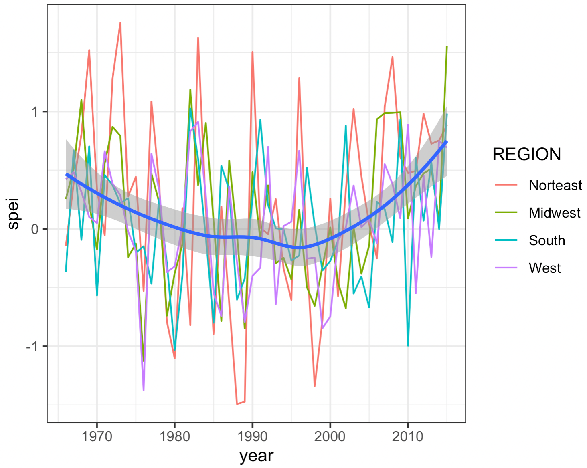
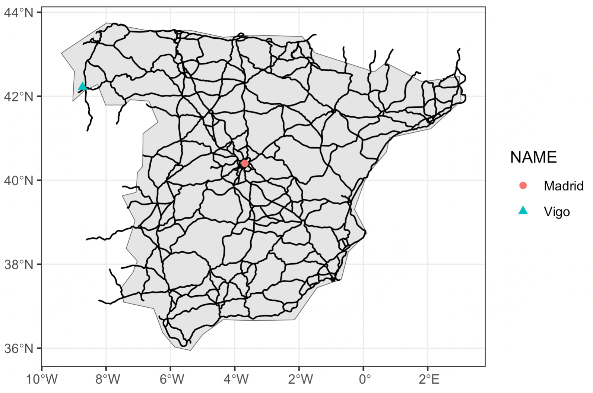
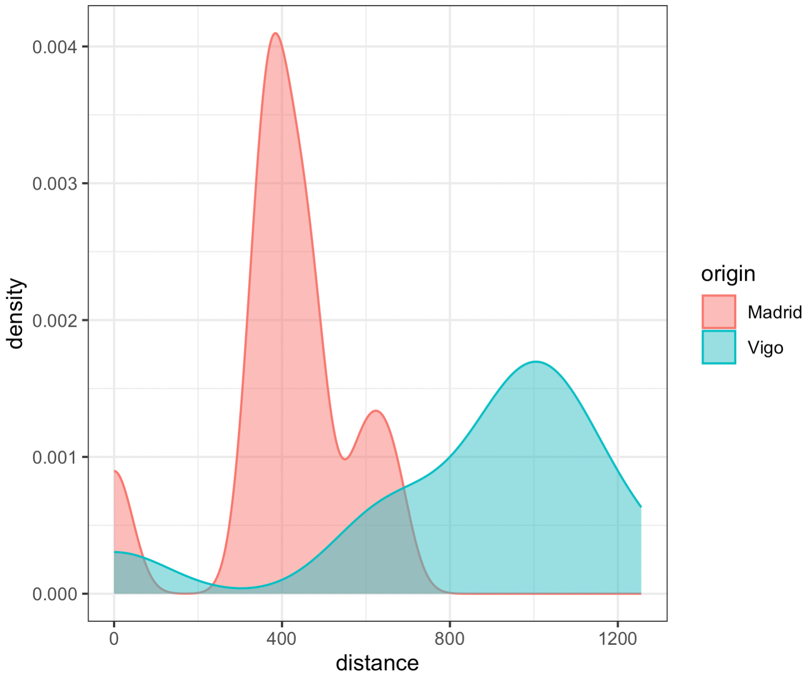

<hr>

```{css, echo=FALSE}
h1.title {
  text-align: center;
}

h4.author, h4.date {
  text-align: center;
}

.author {
  text-align: center;
}

.date {
  text-align: center;
}
```

```{r setup, include=FALSE}
# Load required package for SVG
library(ragg)

# Disable warning messages and SVG plots
knitr::opts_chunk$set(
  warning = FALSE,
  message = FALSE,
  # fig.ext = "svg",
  fig.width = 16,
  fig.height = 8,
  fig.retina = 2,
  dpi = 300,
  dev = "svg"
)
```

<div style="text-align: center;">
  
</div>

<hr>

# Methodology & general code

Throughout this notebook, we will follow the same approach. We begin with Data Loading, where we import and prepare our necessary datasets. We then move to Data Manipulation, where we process and transform our data into the appropriate format for analysis. Finally, in the Visualization section, we create plots to effectively communicate our findings. 

First we load the needed packages:

```{r}
# Main tidyverse (includes ggplot2)
library(tidyverse)

# Spatial packages
library(sf)
library(spData)
library(tidyverse)
library(units)
library(lwgeom)
library(gridExtra)
library(readxl)
library(terra)
library(exactextractr)
```

<hr>

# Exercise 1: Climate change in the USA

# Data Loading 

To analyze the SPEI (Standardized Precipitation Evapotranspiration Index) trends across US regions over the past 50 years, we need the NetCDF file (.nc) containing SPEI raster data and the US geographic data from spData package.
The .nc file with data about the SPEI index has been downloaded from this [website] (https://digital.csic.es/handle/10261/268088).

```{r}
# Import SPEI index
spei_index <- rast("data/ex1/spei01.nc")

# Import US regions
us_states <- spData::us_states
```

# Data wrangling

We first retrieve all dates from the SPEI index, then select only dates between 1965-2015 (our 50-year analysis period, limited by data availability). The zonal statistics step computes the average SPEI for each state, creating a wide-format panel where each row is a state and each column represents a specific date (month and year). We then transform this into a long-format panel, adding state and region identifiers along with separated year and month columns. This restructuring enables us to efficiently compute yearly means, first at the state level and then aggregated to the regional level. The separation of temporal components (year and month) facilitates these temporal aggregations while maintaining the geographic hierarchy (states nested within regions) for spatial analysis.


```{r}
# Get dates from SPEI dataset
dates <- time(spei_index)

# Filter only for years between 1965 and 2015
valid_dates <- which(year(dates) >= 1965 & year(dates) <= 2015)

# Extract the subset of SPEI data for our time period of interest
spei_subset <- spei_index[[valid_dates]]

# Remove from 'dates' the unnecessary dates
dates <- dates[valid_dates]

# Zonal statistics to compute the mean (each row is a country and each column is a date)
zonal_stats <- exact_extract(
  spei_subset,
  us_states,
  fun = "mean"
)

# Convert the wide format panel to long format panel and add state/region identifiers
# This is necessary to compute the yearly mean per country and then the yearly mean per region
spei_long <- zonal_stats %>%
  as.data.frame() %>%
  # Convert from wide to long format
  pivot_longer(
    cols = everything(),
    names_to = "time_index",
    values_to = "spei"
  ) %>%
  # Add state and region identifiers, plus temporal information
  mutate(
    state = rep(us_states$NAME, each = length(dates)),
    region = rep(us_states$REGION, each = length(dates)),
    date = rep(dates, times = nrow(us_states)),
    year = year(date),
    month = month(date)
  ) %>%
  select(state, region, year, month, spei)

# Compute the yearly mean for each state
spei_state_annual <- spei_long %>%
  group_by(state, region, year) %>%
  summarise(
    mean_spei_state = mean(spei, na.rm = TRUE),
    .groups = "drop"
  )

# Compute the yearly mean for each region
spei_regional <- spei_state_annual %>%
  group_by(region, year) %>%
  summarise(
    mean_spei_region = mean(mean_spei_state, na.rm = TRUE),
    .groups = "drop"
  )
```

# Plotting

After these manipulations, we can create a plot that shows the temporal trends of SPEI index for each region (colored lines) and the overall smoothed trend with confidence interval (blue line).

```{r}
# Plotting
ggplot(spei_regional, aes(x = year, y = mean_spei_region, color = region, group = region)) +
  geom_line(linewidth = 0.8) +
  geom_smooth(
    data = spei_regional, aes(x = year, y = mean_spei_region),
    method = "loess", color = "blue", se = TRUE, linewidth = 1.2, inherit.aes = FALSE
  ) +
  scale_color_brewer(palette = "Set2") +
  scale_x_continuous(
    breaks = seq(1970, 2010, by = 10),
    expand = c(0.02, 0.02)
  ) +
  scale_y_continuous(
    limits = c(-1, 1),
    breaks = seq(-1, 1, by = 1)
  ) +
  labs(
    title = "SPEI Index by US Region (1965-2015)",
    x = "Year",
    y = "SPEI Index",
    color = "Region"
  ) +
  theme_minimal() +
  theme(
    plot.title = element_text(hjust = 0.5),
  )
```


In comparison the first graph looked as follows:



<hr>

# Exercise 2: Transportation Centrality

...

In comparison the first map looked as follows:



...

and the second graph as follows:


